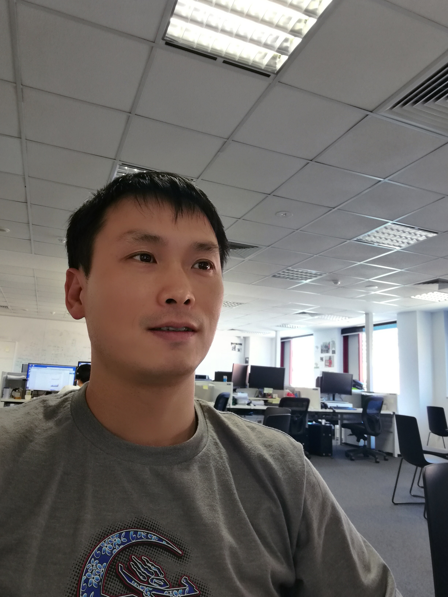

### Biography

Since 2023, I have been working at the **Commonwealth Scientific and Industrial Research Organisation (CSIRO)**, focusing on emerging Large Language Models (LLMs).  

From 2021 to 2023, I founded **Coin Master P2P**, successfully managing a profitable cryptocurrency portfolio, demonstrating entrepreneurial skills and financial acumen.  

Between 2018 and 2021, I was a **Research Fellow** at the **University of Queensland** and **Queensland University of Technology**, applying AI to the early diagnosis of skin cancer.  

I earned my **Ph.D. in Computer Science** from the **University of Adelaide**, with research spanning **structure from motion**, **SLAM**, **computational geometry**, and **robust statistics**. During this time, I was also affiliated with the [**Australian Institute for Machine Learning (AIML)**](https://www.adelaide.edu.au/aiml/).  

Prior to academia, I spent five years as a **Senior Software Engineer** at the **Agricultural Bank of China (ABC)**, beginning in July 2007.  

For a detailed overview of my career, please refer to my [CV](https://qgzhang.github.io/Qianggong_Zhang_CV.pdf).

### Papers

*. BuildingSage: A safe and secure AI copilot for smart buildings.
  Dedeoglu V., Zhang Q., Li Y., Liu J., & Sethuvenkatraman S.
  ACM International Conference on Systems for Energy-Efficient Buildings, Cities, and Transportation (BuildSys 2024)

*. Implicitly Defined Layers in Neural Networks. 
  Zhang Q., Gu Y., Mateusz M., Baktashmotlagh M., & Eriksson A.
  https://arxiv.org/abs/2003.01822. (2020)

*. A Fast Resection-Intersection Method for the Known Rotation Problem.  
  Zhang, Q., Chin, T. J., Le, H. 
  IEEE Conference on Computer Vision and Pattern Recognition (CVPR) 2018. [pdf](https://github.com/qgzhang/qgzhang.github.io/blob/master/papers/res-int.pdf) and [code](https://github.com/qgzhang/qgzhang.github.io/blob/master/codes/res-int.zip)
  
*. Quasiconvex Plane Sweep for Triangulation With Outliers.  
  Zhang, Q., Chin, T. J., Suter, D.   
  IEEE International Conference on Computer Vision (ICCV) 2017. [pdf](http://openaccess.thecvf.com/content_ICCV_2017/papers/Zhang_Quasiconvex_Plane_Sweep_ICCV_2017_paper.pdf) and [code](http://openaccess.thecvf.com/content_ICCV_2017/supplemental/Zhang_Quasiconvex_Plane_Sweep_ICCV_2017_supplemental.zip)

*. Coresets for Triangulation.  
  Zhang, Q., & Chin, T. J.   
  IEEE Transactions on Pattern Analysis and Machine Intelligence (TPAMI) 2017.

*. An Efficient Meta-Algorithm for Triangulation.  
  Zhang, Q., & Chin, T. J.  
  Asian Conference on Computer Vision (ACCV) 2016 Workshops.

